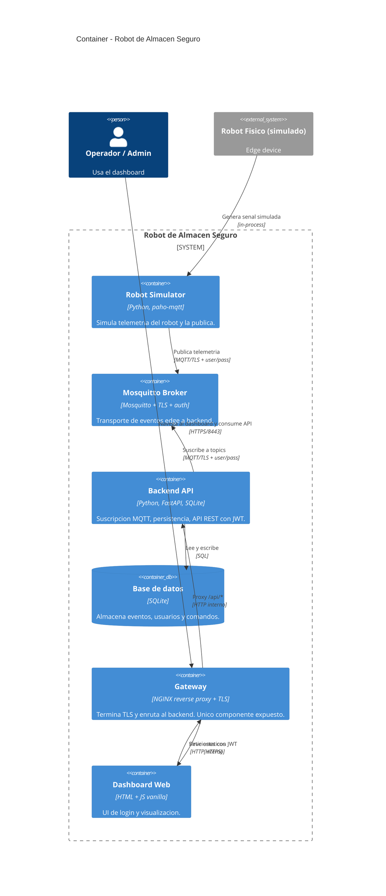

# C4 — Nivel 2: Container

## Propósito
Descomponer el sistema en sus contenedores (procesos/servicios) y mostrar los protocolos de comunicación entre ellos.

## Diagrama

## Contenedores

### 1. Robot Simulator (edge)
- **Tecnología:** Python 3.11 + `paho-mqtt`.
- **Responsabilidad:** generar telemetría realista (posición XY, batería %, estado, obstáculo detectado) y publicarla cada 2 segundos.
- **Topics que publica:**
  - `robot/{id}/telemetry` — estado continuo
  - `robot/{id}/event` — eventos discretos (obstáculo detectado, batería baja)
- **Autenticación:** usuario/password contra el broker, sobre TLS.

### 2. Mosquitto Broker
- **Tecnología:** Eclipse Mosquitto 2.x.
- **Puerto interno/externo:** 8883 (TLS only).
- **Sin listener no cifrado.**
- Lista de usuarios hasheados en `passwd` (generada por script).

### 3. Backend API (FastAPI)
- **Tecnología:** Python 3.11, FastAPI, Uvicorn, SQLAlchemy, paho-mqtt.
- **Responsabilidades:**
  - Suscriptor MQTT que escucha `robot/+/telemetry` y `robot/+/event` y persiste en SQLite.
  - API REST con:
    - `POST /auth/login` → entrega JWT.
    - `GET /api/health` → público.
    - `GET /api/telemetry` → requiere JWT.
    - `GET /api/eventos` → requiere JWT.
    - `POST /api/comandos` → requiere JWT **y rol admin**.
- **No expuesto al exterior**: solo accesible desde la red Docker interna.

### 4. Base de datos (SQLite)
- Archivo en volumen Docker `backend-data`.
- Tablas: `telemetry`, `eventos`, `comandos`.
- Trade-off documentado.

### 5. Gateway (NGINX)
- **Único componente que expone puerto al host (8443).**
- Termina TLS con cert autofirmado.
- Enruta `/api/*` y `/auth/*` al backend, resto al dashboard.
- Rate limiting activo.

### 6. Dashboard Web
- HTML + JS vanilla servido por NGINX.
- Login → obtiene JWT → almacena en memoria (no localStorage) → polling cada 3 s.

## Red y exposición

| Puerto host | Servicio | Propósito |
|-------------|----------|-----------|
| 8443 | gateway (nginx) | **HTTPS** — dashboard y API |
| 8883 | mosquitto | **MQTT/TLS** — exposición para demostración |

El **backend no expone puertos al host**. Tampoco el dashboard.

## Flujo principal
1. El simulador publica telemetría cada 2 s.
2. El backend (suscriptor MQTT) la recibe y guarda en SQLite.
3. El usuario abre `https://localhost:8443`, hace login, obtiene un JWT.
4. El dashboard hace `GET /api/telemetry` con el JWT cada 3 s.
5. El admin puede hacer `POST /api/comandos`; el operador no.
