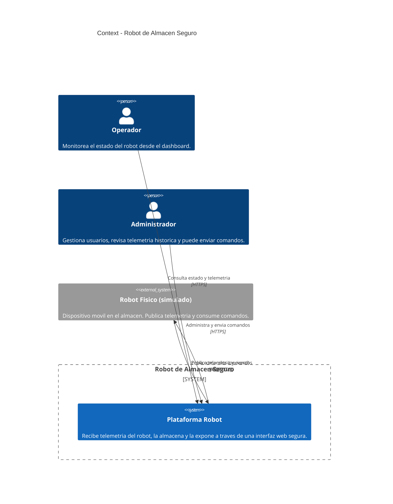

# C4 — Nivel 1: Context

## Propósito
Mostrar el sistema "Robot de Almacén Seguro" en su contexto: quién lo usa, con qué sistemas externos se relaciona, y cuál es su frontera.

## Diagrama

## Actores

| Actor | Descripción | Interacción |
|-------|-------------|-------------|
| **Operador** | Personal de almacén que monitorea al robot en tiempo casi real. | Solo lectura: ver telemetría y estado. |
| **Administrador** | Responsable técnico del sistema. | Lectura + envío de comandos al robot. |
| **Robot físico (simulado)** | Dispositivo edge con sensores (posición, batería, obstáculos). En este MVP se simula. | Publica telemetría / eventos. |

## Alcance

**Dentro del sistema:**
- Ingesta de telemetría vía MQTT.
- Persistencia de eventos.
- Autenticación y autorización de usuarios.
- Dashboard web.
- Gateway de entrada.

**Fuera del sistema:**
- Hardware del robot (se simula).
- Infraestructura de red del almacén.
- Sistemas ERP o WMS (futura integración).
- Identity Provider externo (actualmente se usa auth local; en el futuro, Keycloak/OAuth2).

## Restricciones
- Solo un punto de entrada expuesto (gateway HTTPS).
- El robot no se conecta directamente al backend: siempre pasa por el broker.
- Comunicaciones externas obligatoriamente cifradas (TLS).

## Riesgos iniciales
1. Suplantación del robot o de un operador (mitigado con auth MQTT y JWT).
2. Intercepción de telemetría (mitigado con TLS).
3. Saturación del broker por eventos masivos (DoS).
4. Exposición del backend si el gateway falla (mitigado con red interna Docker).
