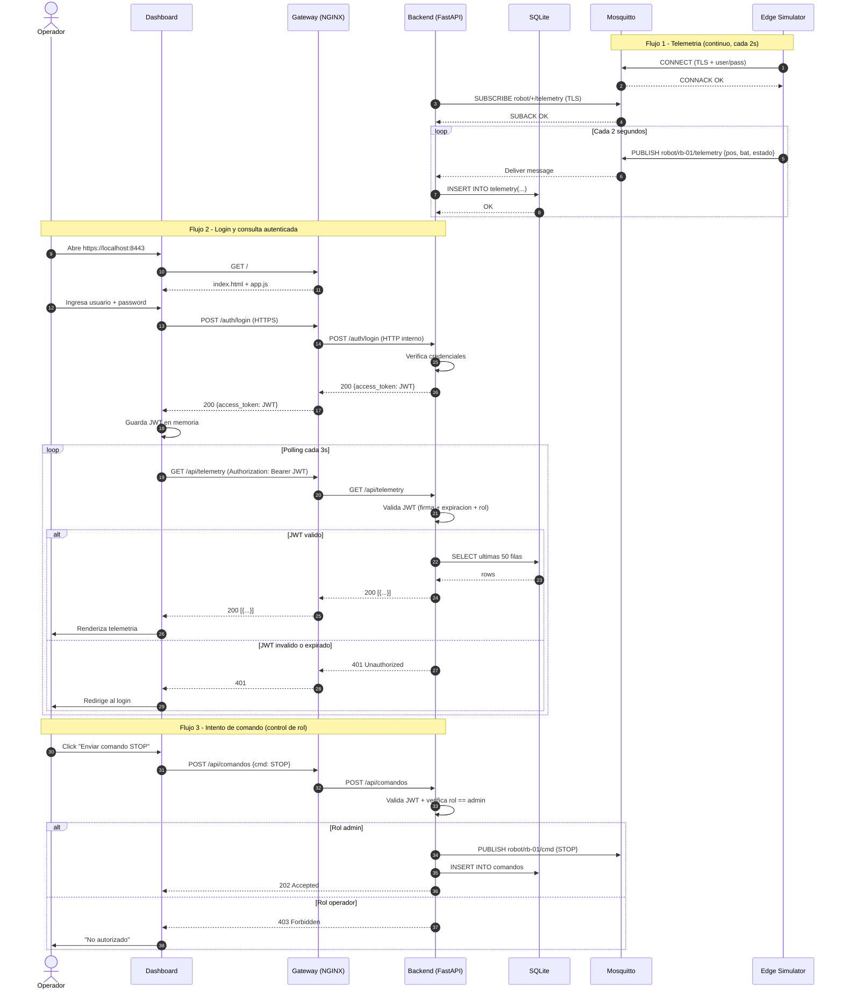

# UML — Diagrama de Secuencia

## Caso: Ciclo completo de telemetría + consulta autenticada

## Lecciones que ilustra este diagrama

- **Separación de canales:** el robot nunca habla directamente con el backend ni con el dashboard. Todo pasa por el broker.
- **Único punto de entrada:** el usuario solo toca el gateway.
- **Zero Trust básico:** cada request a `/api/*` valida el JWT; no hay "confianza por estar en la red interna".
- **Control de autorización:** la pertenencia a la red no basta; se requiere el rol correcto para acciones sensibles.
